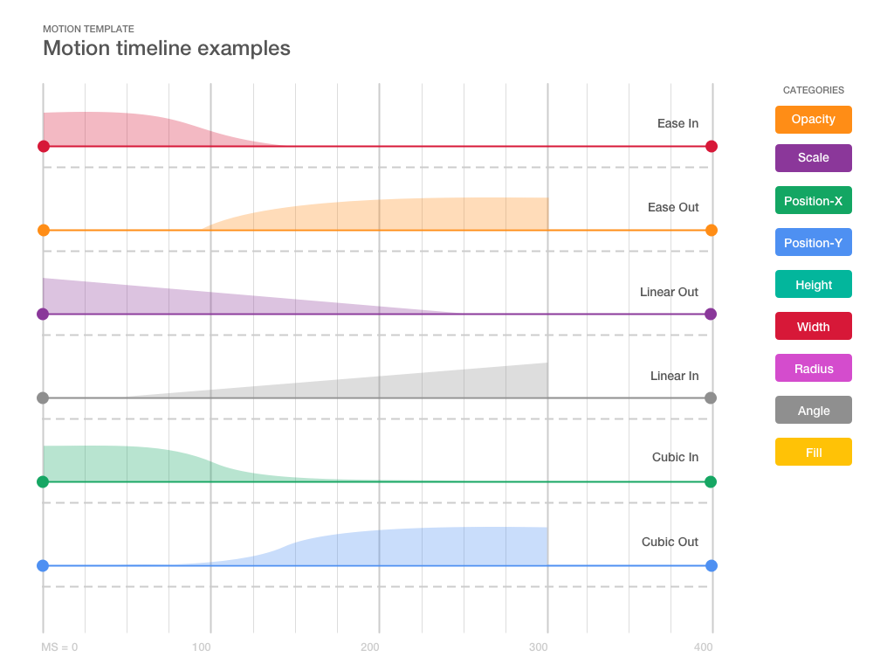

# sketch-motion-graph-template
This is a motion graph template for Sketch

Created symbols for the following curves
* Linear in
* Linear out
* Ease in
* Ease out
* Cubic in
* Cubic out

Symbol styles are colour coded for
* Opacity
* Scale
* Position-X
* Position-Y
* Height
* Width
* Radius
* Angle
* Fill

Grid lines horizontally and vertically are done as symbols.